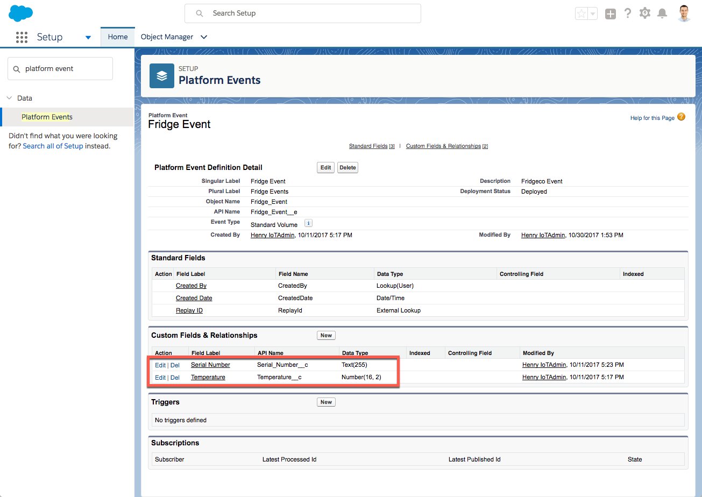
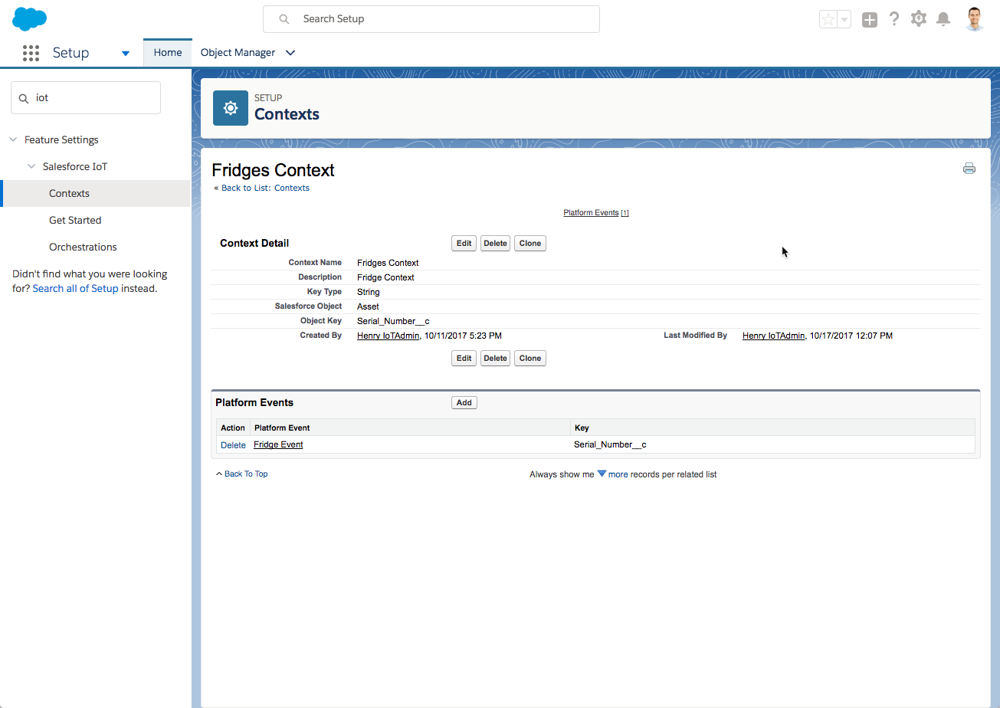
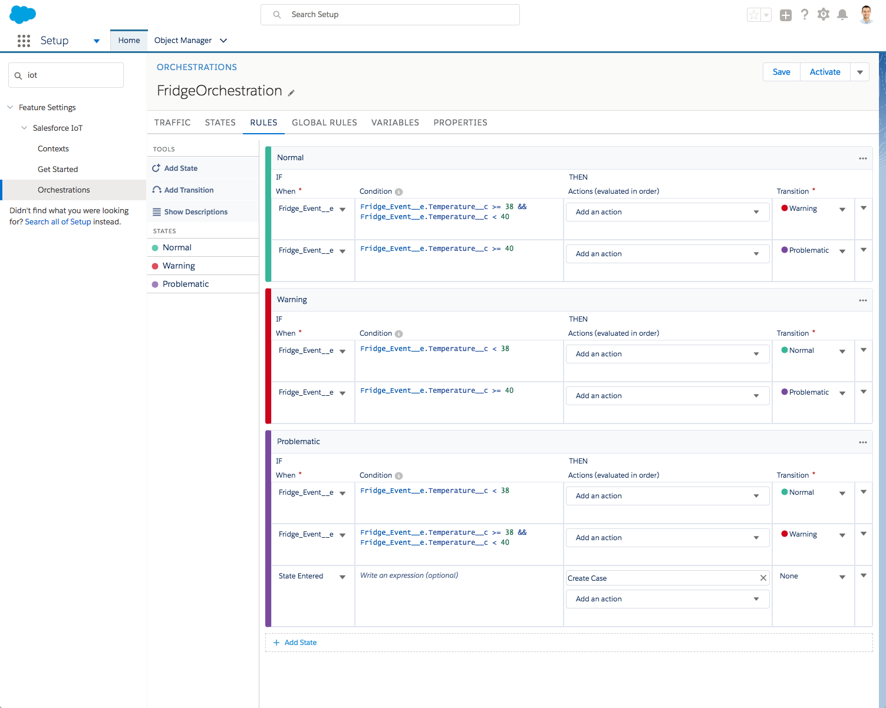
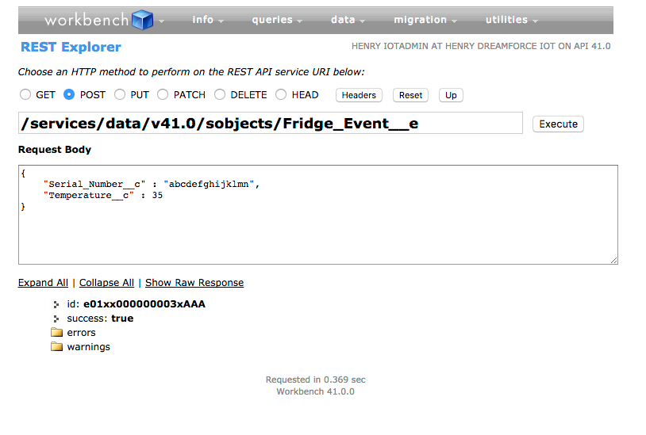

# Platform-Event-Through-Node
This is a node app that pushes Platform Events into Salesforce. Before deploying this, please take a look at how to enable and build Salesforce IoT in your developer org in the last section of this ReadMe.

### Installation
Install npm package so you can use it in your terminal.

### Getting Started
Run the following in the terminal
```
	npm install 
	node index.js
```
You can send platform events in using curl
curl -H "Content-Type: application/json" -X POST -d '{"Serial_Number__c":"abcdefghijklmn","Temperature__c":37}' http://localhost:3000/FridgeEvent

### Deploy to Heroku
Once you have tested on local, you can deploy to heroku by doing
```
	heroku login
	heroku git:remote -a <your_heroku_app>
	git add .
	git commit -am "inital commit to heroku"
	git push heroku master
```


### Following Section gives you an idea how to get started with a very simple Fridge user case in Salesforce IoT
Get a free developer org https://developer.salesforce.com/signup?d=70130000000td6N

1) Create a Platform Event in Setup


2) Enable Salesforce IoT in Setup

3) Create a Context



4) Create an Orchestration



5) Test pushing of Platform Event with workbench

